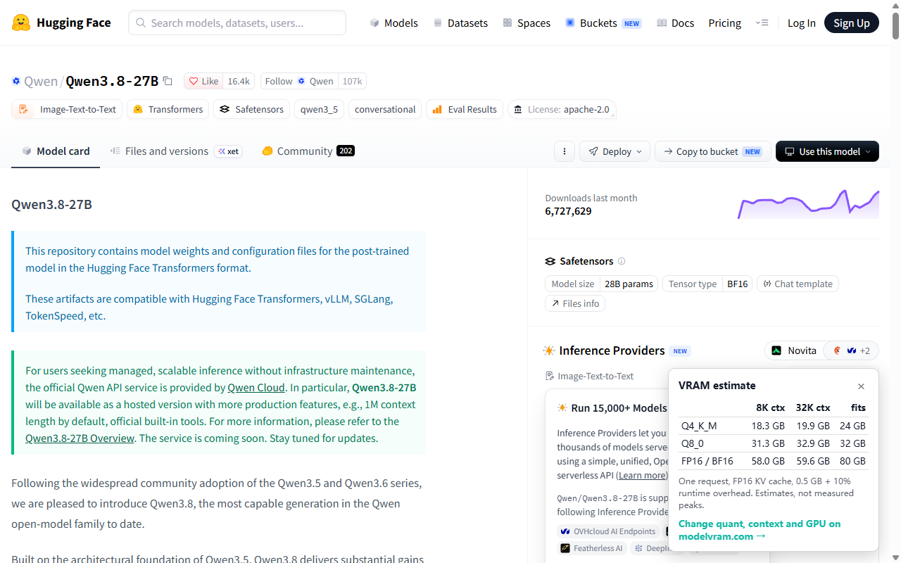

# ModelVRAM: VRAM on Hugging Face

A browser extension that adds a small panel to Hugging Face model pages with the GPU memory the
model needs at Q4_K_M, Q8_0 and FP16/BF16, at 8K and 32K context, and the smallest common GPU it
fits on.

- Reads only the model's public `config.json`, safetensors metadata and file list from
  huggingface.co itself (same origin as the page).
- Asks for no permissions, collects no data, sends nothing anywhere else and runs no remote code.
  The only thing stored is `sessionStorage` "closed for this model" when you press ×.
- Estimates use the calculation core of <https://modelvram.com/llm-vram-calculator/> (MIT):
  one request, FP16 KV cache, 0.5 GB + 10% runtime overhead. They are estimates, not measured peaks.



## Build

Node 22.18 or newer (tested with Node 24), any OS with `tar` (bsdtar) for the optional zip.

```bash
npm ci
npm test
npm run build   # writes dist/ (the extension) and modelvram-extension.zip
```

`dist/content.js` is an unminified esbuild bundle of `src/content.ts`, `src/estimate.ts` and
`src/lib/*.ts`; esbuild is pinned in `package-lock.json`. `src/lib/vram.ts` and `src/lib/hf.ts`
are copied from <https://github.com/159753a52/llm-vram-calculator>.

To try it locally: load `dist/` as an unpacked extension (Chrome/Edge: Extensions → Developer
mode → Load unpacked; Firefox: about:debugging → Load Temporary Add-on → `dist/manifest.json`).

## License

MIT
